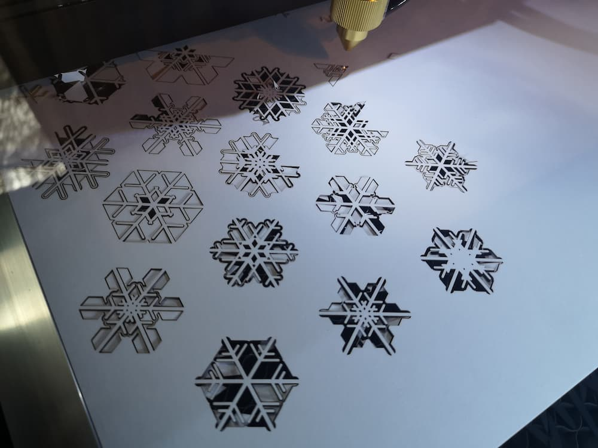
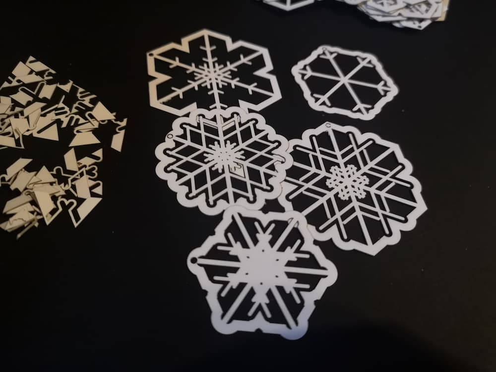
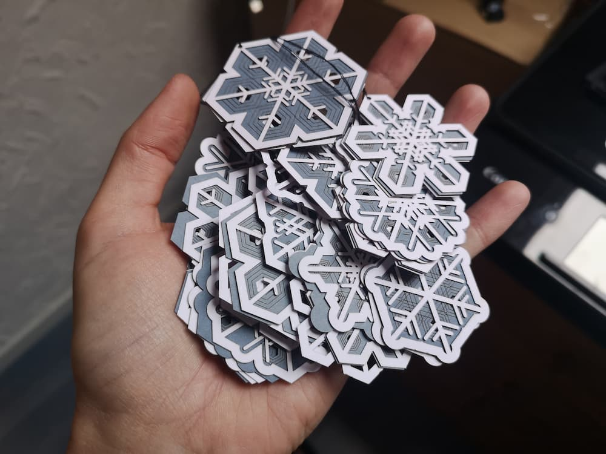
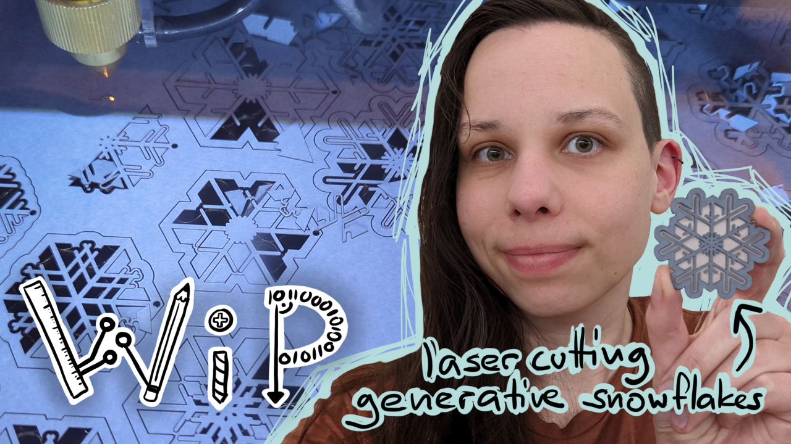

# Fr0zenSystem Laser Edition
Fr0zenSystem is a little snowflake generator. This version is optimized to be used with lasercutters but might also be used with pen- or cutter plotters. The idea is to cut out two different layers that in combination form a nice snowflake shape. 

# Video:
)

# License
This project uses the [Blue Oak License](https://blueoakcouncil.org/license/1.0.0)
